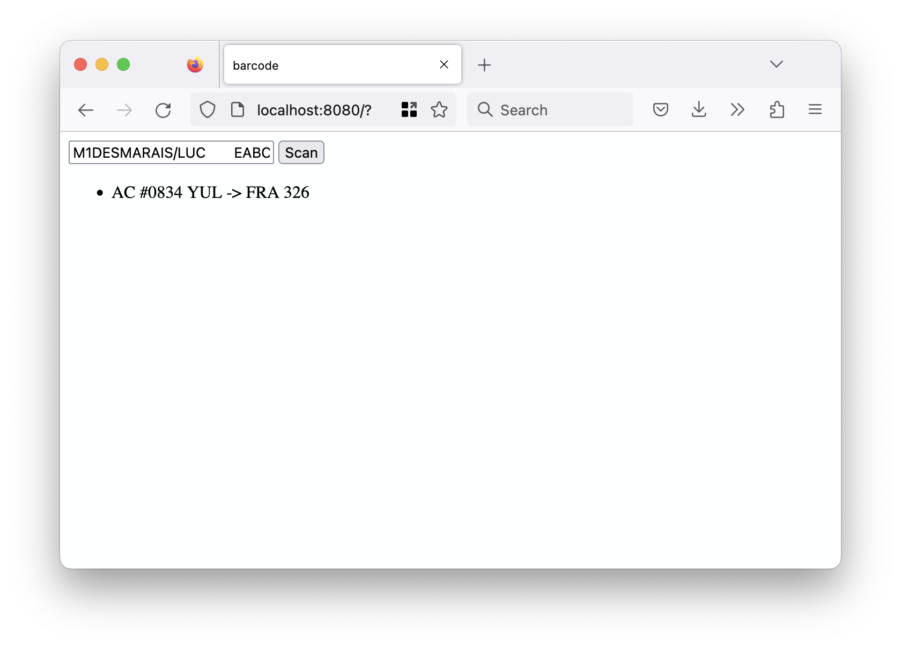

# rs-sfomuseum-bcbp

SFO Museum-specific WebAssembly (WASM) binary wrapping the `martinmroz/iata_bcbp` (Rust) crate.

## Important

This is both a work-in-progress and a learning exercise to get familiar with Rust. Ideally the entirety of the `martinmroz/iata_bcbp` crate would be updated to expose WASM funtionality but this looks like it will be an involved project. In the meantime this exists. It does _not_ return all of the data produced by the `martinmroz/iata_bcbp` crate but rather a list of truncated data for each leg of a flight.

The motivation for this package is to be able to extract basic flight data and non-personally-identifiable-information from the values encoded in the barcodes on boarding passes and to so locally in a web browser so that some reasonable assurances can be made about not snooping on or hoovering up or sending over the wire all that other personally-identifiable-information stored in those barcodes. 

## Building

```
$> make wasm
wasm-pack build --target web
[INFO]: 🎯  Checking for the Wasm target...
[INFO]: 🌀  Compiling to Wasm...
   Compiling rs-sfomuseum-bcbp v0.1.0 (/usr/local/sfomuseum/rs-bcbp-wasm)
    Finished release [optimized] target(s) in 0.42s
[INFO]: ⬇️  Installing wasm-bindgen...
[INFO]: found wasm-opt at "/usr/local/bin/wasm-opt"
[INFO]: Optimizing wasm binaries with `wasm-opt`...
[INFO]: ✨   Done in 1.42s
[INFO]: 📦   Your wasm pkg is ready to publish at /usr/local/sfomuseum/rs-bcbp-wasm/pkg.
```

If you haven't already install the Rust-related WebAssembly dependencies they can be installed like this:

```
$> cargo install wasm-pack
$> rustup target add wasm32-unknown-unknown
```

## Example

There is a working example, including a build of the WASM binary, in the [www](www) folder. This is a plain vanilla web application but will require being served from a web server (rather than a `file://` URL). I like to use [aaronland/go-http-fileserver](https://github.com/aaronland/go-http-fileserver) but that's mostly because I wrote it. Any old web server will do. For example:

```
$> ./bin/fileserver -root /path/to/rs-sfomuseum-bcbp/www/
2023/04/17 22:20:48 Listening on http://localhost:8080
```

And then if you open `http://localhost:8080` in a browser, enter the string `M1DESMARAIS/LUC       EABC123 YULFRAAC 0834 326J001A0025 100` in to the text field and click the "scan" button you should see something like this:



## See also

* https://github.com/martinmroz/iata_bcbp
* https://github.com/sfomuseum/rs-rxing-wasm
* https://rustwasm.github.io/wasm-pack/